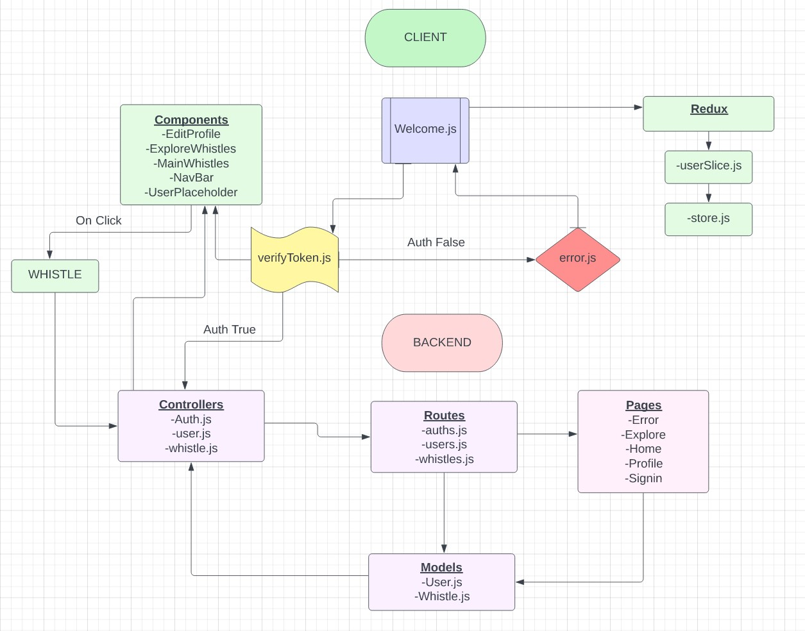

# Whistler

## Description

### Introducing Whistler: Unleash Your Voice, Connect, and Share!

- Whistler is a dynamic and vibrant social media app that takes inspiration from the essence of Twitter while adding its own unique twist. Designed to empower users and create meaningful connections, Whistler provides a platform for individuals to express themselves, engage in conversations, and share their thoughts with the world.

- At the core of Whistler is the idea of unleashing your voice. Whether you're an aspiring influencer, an avid opinion-sharer, or simply someone who loves to stay informed, Whistler offers a space where your ideas can take flight. With a character limit that encourages concise and impactful messages, Whistler allows you to express your thoughts, ideas, and emotions in a succinct and powerful manner.

- Whistler fosters a sense of community by enabling users to connect with like-minded individuals from across the globe. Through hashtags, trending topics, and personalized recommendations, you can easily discover and engage with conversations that resonate with your interests. Follow your favorite influencers, engage in lively discussions, and build connections with people who share your passions.

- One of the standout features of Whistler is its emphasis on real-time updates. Stay informed about the latest happenings, trends, and events as they unfold, and join in the conversation with fellow users. Whistler serves as your personal news hub, allowing you to engage with timely topics and be part of the broader cultural discourse.

- With a sleek and intuitive interface, Whistler offers a seamless user experience on your web browser. Whistler's responsive design ensures you can access the app and engage with the community wherever and whenever inspiration strikes.

- Join Whistler today and let your voice be heard. Connect with passionate individuals, engage in meaningful conversations, and stay up-to-date with the pulse of the world. Whistler: the social media app where ideas take flight and connections are made.

## Team members

- Ryan "I Am Vengeance" Bagan
- Kyle "I Am The Night" Freemantle
- Cody Lobdell
- Thomas Lau

## Links

## User Stories

- As a user of Whistler, I want to be able to share my thoughts, ideas, and experiences with a global community in a concise and impactful manner. I want to connect with like-minded individuals who share my interests and engage in lively discussions on trending topics. I want to stay informed about the latest news and events as they unfold, and have the ability to join conversations in real-time. Additionally, I expect Whistler to offer a seamless user experience on my web browser, allowing me to access and engage with the community anytime, anywhere.

## UML

